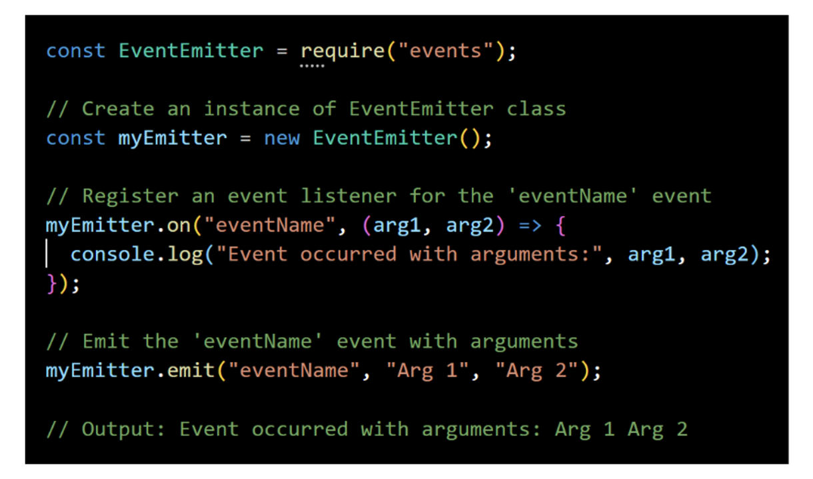

# Questions on Core Modules

### Q1:What are streams ? 

**Answer**: a stream is a sequence of data that is moved from one point to another 

### Q2:Give an example of stream ?

**Answer**: A stream of data being moved from one computer to another 

### Q3: How do we process streams in Node ? 

**Answer**: In node we process streams of data in chunks as they arrive instead of waiting for the entire data to be available before processing 

### Q4: What are buffers ? 

**Answer**: Node cannot control the pace at which data arrives in the stream , it can only decide when is the right time to send the data for processing .If there is data already processed or too little data to process , node puts the arriving data in a buffer .It is an intentionally small area that node maintains in the runtime to process a stream of data

### Q3: Explain the path,events,stream and http module ? 

**Answer**: The path, events,stream and http module is described in the following table 

| Module | Description                                                  |
| ------ | ------------------------------------------------------------ |
| path   | Provides utilities for working with file and directory paths. |
| fs     | Provides an API for interacting with the file system, allowing for reading, writing, and managing files. |
| events | Provides an event-driven architecture and allows for handling and emitting custom events. |
| stream | Provides an API for working with streaming data, including readable and writable streams. |
| http   | Provides the ability to create HTTP servers and make HTTP requests |

### Q4: Name 2 functions of the fs module ? 

**Answer**: fs.readFile(), fs.readFileSync()

### Q5: Name 2 functions of the path module ? 

**Answer**: path.join(), path.resolve()

### Q6: Explain the role of OS module ?

**Answer**:The os module provides a set of methods for interacting with the operating system 

### Q7: How to handle events in node ? 

**Answer**: This is how we handle events in node

```javascript
const EventEmitter = require("events");

//Create an instance of EventEmitter class 
const myEmitter = new EventEmitter(); 

//Register an event listener(eventName) 
myEmitter.on("eventName", () => {  
  console.log("Event occurreed"); 
});

//emit the event
myEmitter.emit("eventName"); 
//Output :Event Occurred
```

### Q8: What are Event Arguments ? 

**Answer**: event arguments refer to the additional information that can be passed along with an emitted event 



### Q9: What is the difference between a function and an event ? 

**Answer**: 

- A function is a reusable piece of code that performs a specific task when invoked or called 
- Events represent actions that can be observed and responded to , events will call functions internally 

### Q10: What is the role of createServer() method of http module ? 

**Answer**: It is used to create a server 