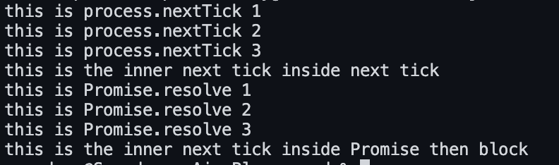
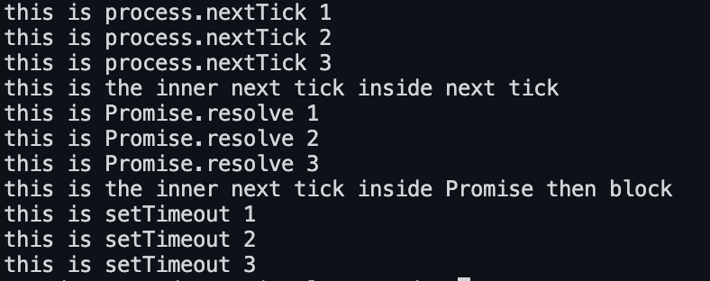
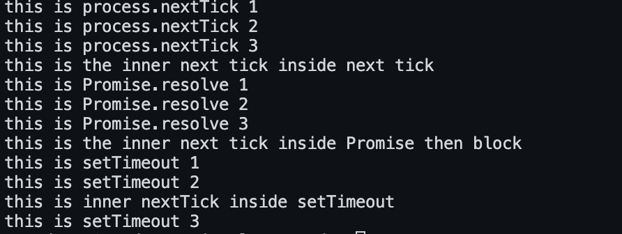
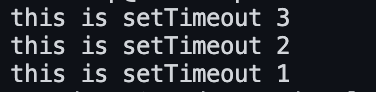
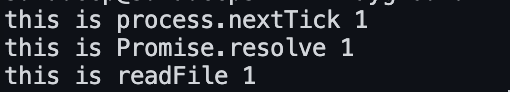
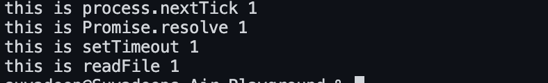
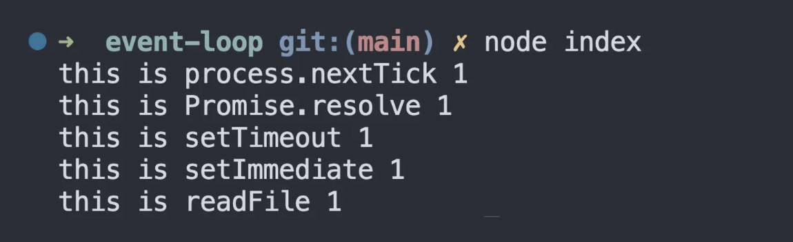
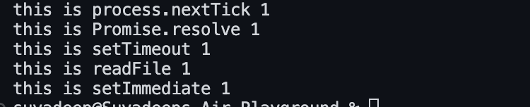
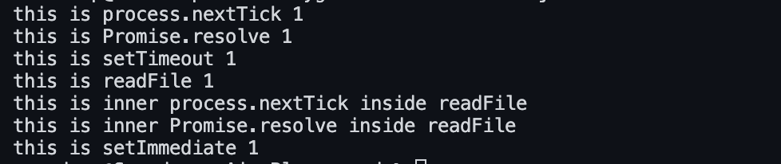
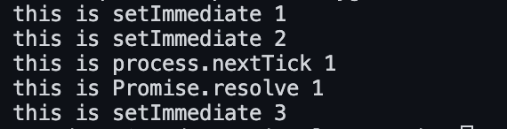

# Event Loop Guess the output Questions 

### Q1: How the event loop Works ? 

**Answer**: Within the event loop , the sequence of execution follows certain rules .

1. Any callbacks in the microtask queue are executed. First, tasks in the nextTick queue and only then tasks in the promise queue.
2. All callbacks within the timer queue are executed.
3. Callbacks in the microtask queue (if present) are executed after every callback in the timer queue. First, tasks in the nextTick queue, and then tasks in the promise queue.
4. All callbacks within the I/O queue are executed.(I/O events are polled and callback functions are added to the I/O queue only after the I/O is complete)
5. Callbacks in the microtask queues (if present) are executed, starting with nextTickQueue and then Promise queue.
6. All callbacks in the check queue are executed.
7. Callbacks in the microtask queues (if present) are executed after every callback in the check queue. First, tasks in the nextTick queue, and then tasks in the promise queue.
8. All callbacks in the close queue are executed.
9. For one final time in the same loop, the microtask queues are executed. First, tasks in the nextTick queue, and then tasks in the promise queue.

If there are more callbacks to be processed at this point, the loop is kept alive for one more run, and the same steps are repeated. On the other hand, if all callbacks are executed and there is no more code to process, the event loop exits.


### Q2:Explain the Asynchronous Code Execution of the below code snippet ? 

```javascript
const fs = require("fs");

console.log("First");

fs.readFile(__filename, () => {

  console.log("Second");

});

console.log("Third");
```

**Answer**: The main thread of execution always starts in the global scope. The global function is pushed onto the stack. Execution then comes to line 1. At 1ms, "First" is logged in the console, and the function is popped off the stack. Execution then moves on to line 3. At 2ms, the readFile method is pushed onto the stack. Since readFile is an asynchronous operation, it is off-loaded to libuv.

JavaScript pops off the readFile method from the call stack because its job is done as far as the execution of line 3 is concerned. In the background, libuv starts to read the file contents on a separate thread. At 3ms, JavaScript proceeds to line 7, pushes the log function onto the stack, "Third" is logged to the console, and the function is popped off the stack.

At about 4ms, let's say that the file read task is completed in the thread pool. The associated callback function is now executed on the call stack. Within the callback function, the log statement is encountered.

That is pushed to the call stack, "Second" is logged to the console, and the log function is popped off. As there are no more statements to execute in the callback function, it is popped off as well. There's no more code to run, so the global function is also popped off the stack.

The console output is going to read `"First", "Third", and then "Second"`.

### Q3:Experiment 1: Guess the output of below code snippet ? 

```javascript
console.log("console.log 1");

process.nextTick(() => console.log("this is process.nextTick 1"));

console.log("console.log 2"); 
```

**Answer**: The output will be `console.log 1 this is process.nextTick 1 console.log 2`

### Q4:Experiment 2 : Guess the output of below code snippet ? 

```javascript
Promise.resolve().then(() => console.log("this is Promise.resolve 1"));

process.nextTick(() => console.log("this is process.nextTick 1"));
```

**Answer**: The output will be `this is process.nextTick 1 this is Promise.resolve 1`

### Q5:Bonus Experiment : What will be the output of below code snippet ? 

```javascript
process.nextTick(() => console.log("this is process.nextTick 1"));
process.nextTick(() => {
  console.log("this is process.nextTick 2");
  process.nextTick(() =>
    console.log("this is the inner next tick inside next tick")
  );
});
process.nextTick(() => console.log("this is process.nextTick 3"));

Promise.resolve().then(() => console.log("this is Promise.resolve 1"));
Promise.resolve().then(() => {
  console.log("this is Promise.resolve 2");
  process.nextTick(() =>
    console.log("this is the inner next tick inside Promise then block")
  );
});
Promise.resolve().then(() => console.log("this is Promise.resolve 3"));
```

**Answer**: The output will be the following 



### Q6 :Experiment 3 What will be the output of below code snippet ?  

```javascript
setTimeout(() => console.log("this is setTimeout 1"), 0);

setTimeout(() => console.log("this is setTimeout 2"), 0);

setTimeout(() => console.log("this is setTimeout 3"), 0);

process.nextTick(() => console.log("this is process.nextTick 1"));

process.nextTick(() => {

  console.log("this is process.nextTick 2");

  process.nextTick(() =>

​    console.log("this is the inner next tick inside next tick")

  );

});

process.nextTick(() => console.log("this is process.nextTick 3"));

Promise.resolve().then(() => console.log("this is Promise.resolve 1"));

Promise.resolve().then(() => {

  console.log("this is Promise.resolve 2");

  process.nextTick(() =>

​    console.log("this is the inner next tick inside Promise then block")

  );

});

Promise.resolve().then(() => console.log("this is Promise.resolve 3"));
```

**Answer**: The output will be the following 



### Q7:Experiment 4 Guess the output of below code snippet ? 

```javascript
setTimeout(() => console.log("this is setTimeout 1"), 0);

setTimeout(() => {

  console.log("this is setTimeout 2");

  process.nextTick(() =>

​    console.log("this is inner nextTick inside setTimeout")

  );

}, 0);

setTimeout(() => console.log("this is setTimeout 3"), 0);

process.nextTick(() => console.log("this is process.nextTick 1"));

process.nextTick(() => {

  console.log("this is process.nextTick 2");

  process.nextTick(() =>

​    console.log("this is the inner next tick inside next tick")

  );

});

process.nextTick(() => console.log("this is process.nextTick 3"));

Promise.resolve().then(() => console.log("this is Promise.resolve 1"));

Promise.resolve().then(() => {

  console.log("this is Promise.resolve 2");

  process.nextTick(() =>

​    console.log("this is the inner next tick inside Promise then block")

  );

});

Promise.resolve().then(() => console.log("this is Promise.resolve 3"));
```

**Answer**: The output is shown in the below diagram 



### Q8: Experiment 5 Guess the output of below code snippet 

```javascript
setTimeout(() => console.log("this is setTimeout 1"), 1000);

setTimeout(() => console.log("this is setTimeout 2"), 500);

setTimeout(() => console.log("this is setTimeout 3"), 0);
```

**Answer**: The following image shows the output 



### Q9:Experiment 6 Guess the output of below code snippet ? 

```javascript
const fs = require("fs");

fs.readFile(__filename, () => {

  console.log("this is readFile 1");

});

process.nextTick(() => console.log("this is process.nextTick 1"));

Promise.resolve().then(() => console.log("this is Promise.resolve 1"));
```

**Answer**: The output of the above code snippet is shown below



### Q10 Experiment 7 Guess the output of below code snippet 

```javascript
const fs = require("fs");

setTimeout(() => console.log("this is setTimeout 1"), 0);

fs.readFile(__filename, () => {

  console.log("this is readFile 1");

});
```

**Answer**: For setTimeout the calculation is capped at a maximum of 1 millisecond i.e even if we pass 0 millisecond it is overwritten to a 1 milisecond delay 

At the start of the event loop, Node.js needs to determine if the 1ms timer has elapsed or not. If the event loop enters the timer queue at 0.05ms and the 1ms callback hasn't been queued, control moves on to the I/O queue, executing the `readFile()` callback. In the next iteration of the event loop, the timer queue callback will be executed.

On the other hand, if the CPU is busy and enters the timer queue at 1.01 ms, the timer will have elapsed and the callback function will be executed. Control will then proceed to the I/O queue, and the `readFile() `callback will be executed.

Due to the uncertainty of how busy the CPU can be and the 0ms delay being overwritten as 1ms delay, we can never guarantee the order of execution between a 0ms timer and an I/O callback.

Inference

> When running `setTimeout()` with a delay of 0ms and an I/O async method, the order of execution can never be guaranteed.

### Q11 Experiment 8 Guess the output of below code snippet ? 

```javascript
const fs = require("fs");

fs.readFile(__filename, () => {

  console.log("this is readFile 1");

});

process.nextTick(() => console.log("this is process.nextTick 1"));

Promise.resolve().then(() => console.log("this is Promise.resolve 1"));

setTimeout(() => console.log("this is setTimeout 1"), 0);

for (let i = 0; i < 2000000000; i++) {}
```

**Answer**: The output is shown in below code snippet 



### Q12: Experiment 9 Guess the output of below code snippet ? 

```javascript
const fs = require("fs");

fs.readFile(__filename, () => {

  console.log("this is readFile 1");

});

process.nextTick(() => console.log("this is process.nextTick 1"));

Promise.resolve().then(() => console.log("this is Promise.resolve 1"));

setTimeout(() => console.log("this is setTimeout 1"), 0);

setImmediate(() => console.log("this is setImmediate 1"));

for (let i = 0; i < 2000000000; i++) {}
```

**Answer**: The output is shown in the below image 



First, all functions are executed on the call stack, resulting in callbacks being queued up in the appropriate queues. However, the `readFile()` callback is not queued up at the same time. Let me explain why.

When the control enters the event loop, the microtask queues are checked first for callbacks. In this case, there is one callback in each of the nextTick queue and the promise queue. The nextTick queue has priority, so we see "nextTick 1" logged first, followed by "Promise 1".

Both queues are empty, and control moves to the timer queue. There is one callback, which logs "setTimeout 1" to the console.

Now comes the interesting part. When the control reaches the I/O queue, we expect the `readFile()` callback to be present, right? After all, we have a long-running `for` loop, and `readFile()` should have completed by now.

However, in reality, the event loop has to poll to check if I/O operations are complete, and it only queues up completed operation callbacks. This means that when the control enters the I/O queue for the first time, the queue is still empty.

The control then proceeds to the polling part of the event loop, where it checks with `readFile()` if the task has been completed. `readFile()` confirms that it has, and the event loop now adds the associated callback function to the I/O queue. However, the execution has already moved past the I/O queue, and the callback has to wait for its turn to be executed.

The control then proceeds to the check queue, where it finds one callback. It logs "setImmediate 1" to the console and then starts a new iteration because there is nothing else left to process in the current iteration of the event loop.

It appears that the microtask and timer queues are empty, but there is a callback in the I/O queue. The callback is executed, and "readFile 1" is finally logged to the console.

This is why we see "setImmediate 1" logged before "readFile 1". This behavior actually occurred in our previous experiment as well, but we didn't have any further code to run, so we didn't observe it.

### Q13: Experiment 10 Guess the output of below code snippet ? 

```javascript
const fs = require("fs");

fs.readFile(__filename, () => {

  console.log("this is readFile 1");

  setImmediate(() => console.log("this is setImmediate 1"));

});

process.nextTick(() => console.log("this is process.nextTick 1"));

Promise.resolve().then(() => console.log("this is Promise.resolve 1"));

setTimeout(() => console.log("this is setTimeout 1"), 0);

for (let i = 0; i < 2000000000; i++) {}
```

**Answer**: The output is shown in the below code snippet 



### Q14: Experiment 11 Guess the output of below code snippet ? 

```javascript
const fs = require("fs");

fs.readFile(__filename, () => {

  console.log("this is readFile 1");

  setImmediate(() => console.log("this is setImmediate 1"));

  process.nextTick(() =>

​    console.log("this is inner process.nextTick inside readFile")

  );

  Promise.resolve().then(() =>

​    console.log("this is inner Promise.resolve inside readFile")

  );

});

process.nextTick(() => console.log("this is process.nextTick 1"));

Promise.resolve().then(() => console.log("this is Promise.resolve 1"));

setTimeout(() => console.log("this is setTimeout 1"), 0);

for (let i = 0; i < 2000000000; i++) {}
```

**Answer**: The output is shown in the below image 



### Q15: Experiment 12 Guess the output of below code snippet ? 

```javascript
setImmediate(() => console.log("this is setImmediate 1"));

setImmediate(() => {

  console.log("this is setImmediate 2");

  process.nextTick(() => console.log("this is process.nextTick 1"));

  Promise.resolve().then(() => console.log("this is Promise.resolve 1"));

});

setImmediate(() => console.log("this is setImmediate 3"));
```

**Answer**: The output is shown in the below code snippet 



### Q16 Experiment 13 Guess the output of below code snippet 

```javascript
setTimeout(() => console.log("this is setTimeout 1"), 0);

setImmediate(() => console.log("this is setImmediate 1"));
```

**Answer**: Due to the uncertainty of CPU usage, we can never guarantee the execution order between a 0ms timer and a check queue callback. For a more in-depth explanation, refer to [experiment 7](https://www.builder.io/blog/visualizing-nodejs-io-queue#experiment-7).

Inference

> The order of execution can never be guaranteed when running `setTimeout()` with a delay of 0ms and the `setImmediate()` method.

### Q17:Experiment 14 Guess the output of below code snippet ? 

```javascript
const fs = require("fs");

const readableStream = fs.createReadStream(__filename);

readableStream.close();

readableStream.on("close", () => {

  console.log("this is from readableStream close event callback");

});

setImmediate(() => console.log("this is setImmediate 1"));

setTimeout(() => console.log("this is setTimeout 1"), 0);

Promise.resolve().then(() => console.log("this is Promise.resolve 1"));

process.nextTick(() => console.log("this is process.nextTick 1"));
```

**Answer**: The output is shown in the below image 