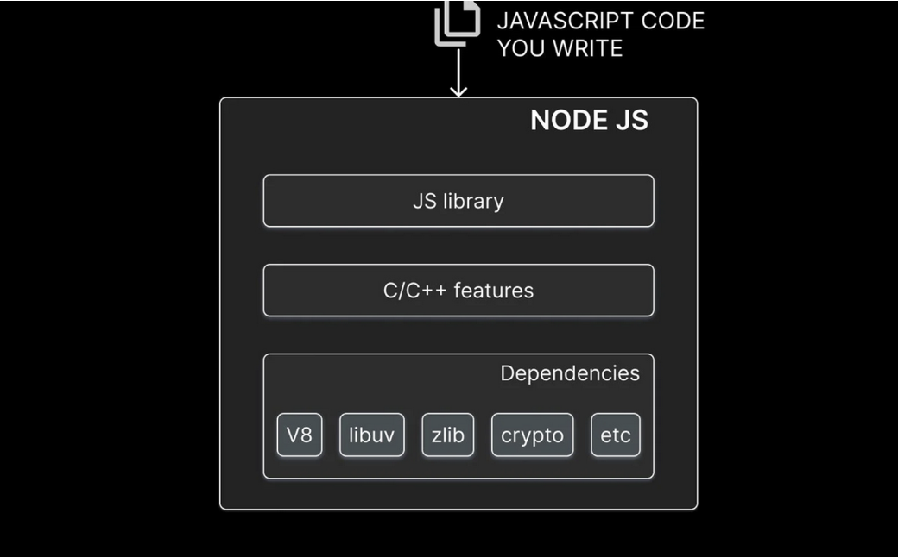
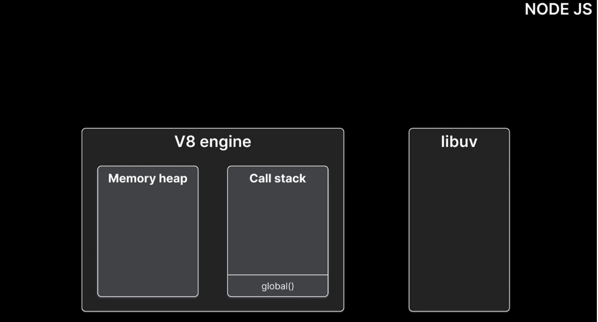

# Event Loop Questions

### Q1: "javascript is a synchronous , blocking , single-threaded language" Is the above statement correct ? 

**Answer**: yes 

### Q2: Draw a picture of the Node.js runtime ? 

**Answer**: 

- **External dependencies** — such as V8, libuv, crypto — required by Node.js for its functioning
- **C++ features** that provide for functionality such as file system access and networking
- A **JavaScript library** that provides functions and utilities to tap into the C++ features from your JavaScript code

### Q3: What is the role of libel in Node.js runtime ?

**Answer**: libuv helps handle asynchronous operations in Node.js. For async operations like handling a network request, libuv relies on the operating system primitives. For async operations like reading a file that has no native OS support, libuv relies on its thread pool to ensure that the main thread is not blocked.

### Q4: How code is executed in the Node.js runtime ? 

The V8 Engine handles the execution of javascript code.The engine comprises a memory heap and a call stack . Whenever we declare variables or functions , memory is allocated on the heap and whenver we execute code , they are pushed into the call stack .When they are done executing it is popped off the call stack

Whenever we execute an asynchronous method, libuv takes over the execution of the task. Libuv then runs the task using native asynchronous mechanisms of the operating system. In case the native mechanisms are not available or inadequate, it utilizes its thread pool to run the task, ensuring that the main thread is not blocked.

### Q5: What is the event loop ? 

**Answer** :a design pattern which coordinates the execution of synchronous and asynchronous code in Node.js 

### Q6: What are the 6 different queues in the event loop ? 

**Answer**: There are 6 different queues in every loop , each holding one or more callback functions that needs to be executed on the call stack eventually

1. **Timer Queue**: holds callbacks associated with `setTimeout` and `setInterval`
2. **i/o queue** : contains callbacks associated with all the async methods such as methods associated with the fs and http modules
3. **check queue** : callbacks associated with `setImmediate` function (which is specific to node)
4. **close queue** : callbacks associated with the close event of an async tasks

Finally there is a microtask queue which contains 2 specific queues :

1. `nextTick` queue which holds callbacks associated with `process.nextTick`
2. `Promise queue` which holds callbacks associated with the `native Promise in Javascript`

### Q7: How the event loop works ? 

**Answer**: Within the event loop, the sequence of execution follows certain rules.

1. Any callbacks in the microtask queue are executed. First, tasks in the nextTick queue and only then tasks in the promise queue.
2. All callbacks within the timer queue are executed.
3. Callbacks in the microtask queue (if present) are executed after every callback in the timer queue. First, tasks in the nextTick queue, and then tasks in the promise queue.
4. All callbacks within the I/O queue are executed.(i/o events are polled and callback functions are added to the i/o queue only after the i/o is complete)
5. Callbacks in the microtask queues (if present) are executed, starting with nextTickQueue and then Promise queue.
6. All callbacks in the check queue are executed.
7. Callbacks in the microtask queues (if present) are executed after every callback in the check queue. First, tasks in the nextTick queue, and then tasks in the promise queue.
8. All callbacks in the close queue are executed.
9. For one final time in the same loop, the microtask queues are executed. First, tasks in the nextTick queue, and then tasks in the promise queue.

If there are more callbacks to be processed at this point, the loop is kept alive for one more run, and the same steps are repeated. On the other hand, if all callbacks are executed and there is no more code to process, the event loop exits.

### Q8: Commonly used timing features in node.js 

**Answer**: Some of the commonly used timing features in Node are

1. setTimeout
2. setInterval
3. setImmediate
4. process.nextTick()

### Q9: Exit codes of node 

**Answer**: Here are the commonly used exit codes of Node 

| exit code | Description                            |
| --------- | -------------------------------------- |
| 0         | Succesfull execution                   |
| 1         | uncaught Fatal Exception               |
| 3         | Internal Javascript Parse Error        |
| 4         | Internal JavaScript Evaluation Failure |
| 8         | Uncaught Exception                     |

