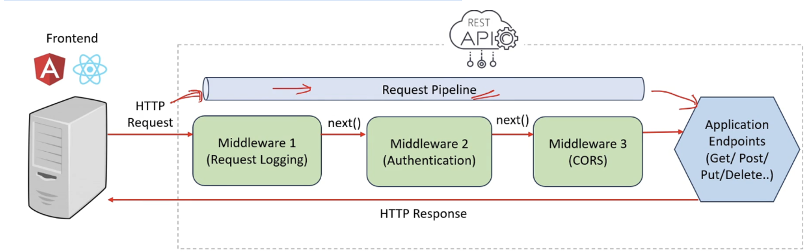

# Middleware Questions

### Q1: What is middleware in Express.js ? 

**Answer**:The following are the salient features of middleware:

- function that *handles HTTP requests*
- *can modify the request or end the request-response cycle*

### Q2: What is the purpose of the app.use() function in express ? 

**Answer**: The app.use() method is used to *mount middleware functions gloabally* 

### Q3: What is the purpose of the next parameter in express.js 

**Answer**: The next parameter is a callback function which is used to *pass control to the next middleware function in the stack* 

### Q4: Implement a  middleware globally for a specific route say `"/exapmple"`

**Answer**: use `app.use(”/specificRoute”,myMiddleware)` to use middleware globally for a specific route in express.js

```javascript
//Initialize an Express application

const express = require("express");

const app = express();

//Define middleware function

const myMiddleware = (req, res, next) => {

  console.log("middleware for specific route");
  next()

  
};

//Use middleware globally for all users on "/example" route

app.use("/example", myMiddleware);

//Start the server

app.listen(3000, () => {

  console.log("Server is running on port 3000");

});
```

### Q5: What is request pipeline in express ? 

**Answer**: The request pipeline in express.js is a series of middleware functions that handle incoming HTTP requests and pass control to the next function 



### Q6: What are the types of middleware in express.js 

**Answer**: The following are the various types of middleware in express.js

1. Application-level middleware
2. Router-level middleware
3. Error-handling middleware
4. Built in middleware
5. Third party middleware

### Q7: What is the difference between application-level and router-level middleware ? 

**Answer**: application-level middleware applies globally to all incoming requests in the entire express.js applications. router-level middleware applies only to specific routes , not all incoming requests

### Q8: What is error handling middleware ? 

**Answer**: error handling middleware in express is a special kind of middleware used to manage errors happening while handling incoming requests . To implement error handling middleware in express define middleware with 4 parameters (err,req,res,next) ,here the additional error object parameter will be used for error handling 

```javascript
app.use((err, req, res, next) => {

  console.error(err.stack);

  res.status(500).send("Something went wrong");

});
```

### Q9: If you have 5 middleware then in which middleware you will do the error handling ? 

**Answer**:In case of multiple middleware , error handling middleware should be defined at last(after all other middleware) because when an error occurs express.js will search for the next error-handling middleware skipping any regular middleware  

### Q10: What is built in middlewares  ? Give an example of a built in middleware in express ? 

**Answer**:built in middlewares are built in functions inside express framework which provide common functionalities .example is express.static() middleware which is used for serving static files 

```javascript
const express = require("express");

const app = express();

//serve static files from the public folder

app.use(express.static("public"));
```

### Q11: What are third party middlewares ? Give some examples 

**Answer**: Third party middleware in express.js are modules developed by third party developers (not part of core express.js) 

| third party middleware | what purpose they serve ? |
| ---------------------- | ------------------------- |
| morgan                 | Logging                   |
| helmet                 | Security                  |
| body-parser            | body parsing              |
| compression            | Compression               |

### Q12: Types of middleware 

**Answer**:The various types of middleware are explained in the follwing table 

| Middleware                   | Purpose                                                      |
| ---------------------------- | ------------------------------------------------------------ |
| application-level middleware | middleware applied to all routes                             |
| router-level-middleware      | middleware specific to certain routes                        |
| built-in-middleware          | pre-packaged middleware included with express.js , like for serving static files |
| error-handling middleware    | middleware for handling errors , declared after other middleware , triggered on errors |

 

### Q13: Advantages of using middleware in express.js 

**Answer**: The following are the advantages of using middleware 

1. Modularity ⇒ middleware allows us to modularize our applications functionality into smaller, self-contained units .Each middleware function can handle a specific task or concern such as logging,authentication or error-handling
2. Reusability ⇒ middlewares can be reused at multiple places and that makes application code easier to maintain
3. Improved request handling ⇒ middlewares functions have access to both the request(req) and response(res) objects which enables us to perform validations on request or modify the response before sending it back to the client
4. Flexible control flow ⇒ middleware functions can be applied globally to all routes or selectively to specific routes allowing us to control the flow of request processing to our application
5. Third party middlewares ⇒ express.js offers a wide range of third party middleware packages that provide additional functionality eg-body-parser,cors