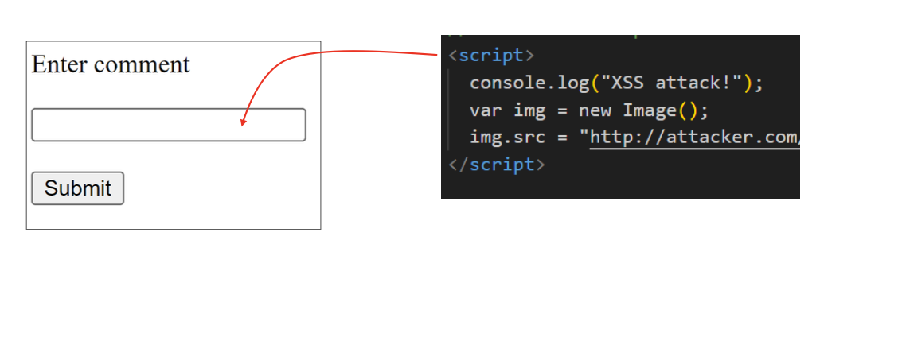
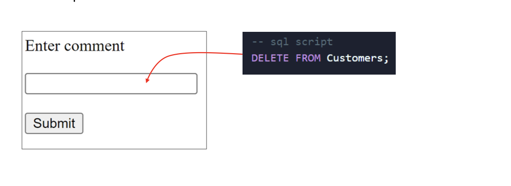
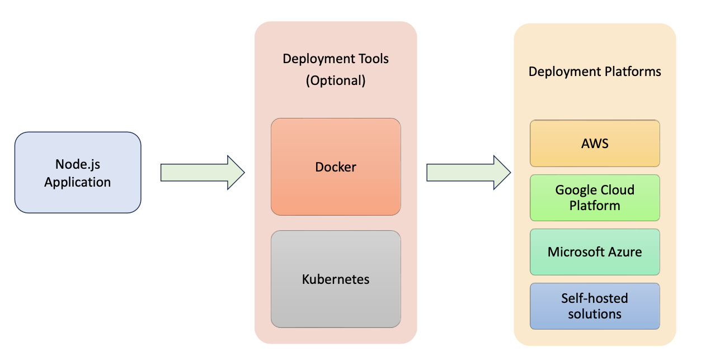

# Security,Performance And Deployment 

###  Q1: What is XSS(Cross-Site Scripting) attack ? 

**Answer**: XSS(Cross-Site Scripting) is a security attack when a hacker insert some *malicious script code in input fields* to steal or manipulate content 



### Q2: How to prevent XSS attcaks ? 

**Answer**: *sanitize-html* module is a library for Node.js that sanitises HTML input by removing potientially malicious code, helping prevent Cross-Site Scripting (XSS) attacks

### Q3: What is SQL Injection attack ?

**Answer**: SQL Injection is a security attcak when a hacker insert some *malicious SQL script code* in input fields to steal or manipulate content 



### Q4: How do you prevent SQL injection attacks in Node ? 

- Use *Parameterized Queries with Prepared Statements* 
- Do not use dynamic queries 

```javascript
const mysql = require("mysql");

const connection = mysql.createConnection({

  host: "localhost",

  user: "root",

  password: password,

  database: "mydatabase",

});

const userId = req.query.userId;

//Prepare a SQL statement with a placeholder for the userId

const sql = "SELECT * FROM userss WHERE id =?";

//execute the query with the userId as a parameter

connection.query(sql, [userId], (error, results) => {

  if (error) {

​    throw error;

  }

  console.log(results);

});

connection.end();
```

### Q5 : How can you improve the performance of a Node.js application ?

**Answer**: We can improve performance of a node.js application with the following 

1. *Optimise database queries*
2. Use *Asynchronous Operations*
3. Use *Caching*
4. Implement *Load Balancing* 
5. Enable *Compression*
6. Use *Streaming for i/o Operations*
7. Monitor *Profile Peformance*

### Q6:How can you Deply a Node.js application ? 

**Answer**: 



